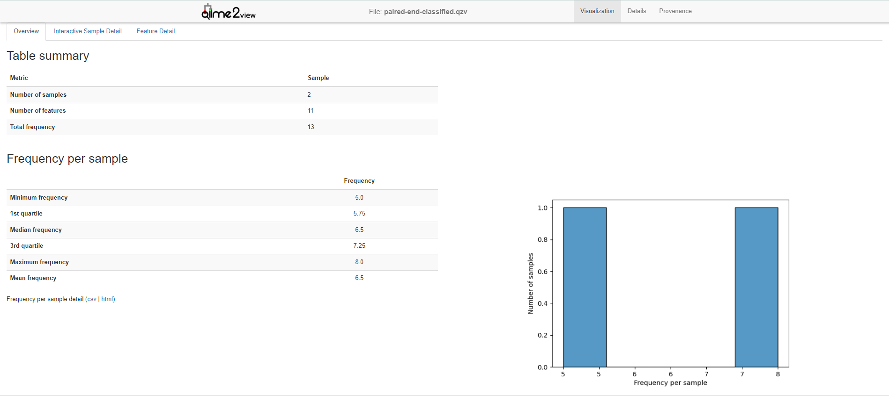
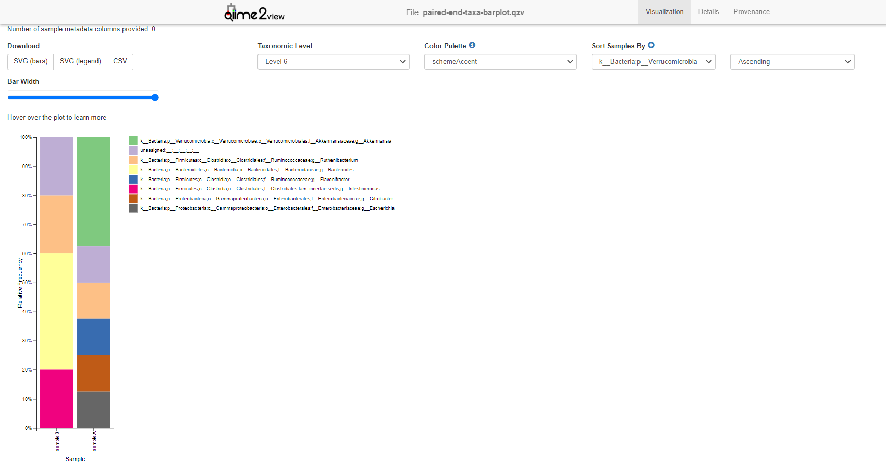

# q2-mOTUs
This is a QIIME 2 wrapper for [mOTU-tool](https://motu-tool.org/). For details on QIIME 2, see https://qiime2.org. The tool will help you to assign taxonomy to your metagenomic samples

# Requirements
- QIIME 2 >= 2022.8 (https://qiime2.org/)
- Git
# Installation
## 1. Install QIIME 2
Follow the instructions on https://docs.qiime2.org/2022.8/install/native/ to install QIIME 2. You will need to install the latest version of QIIME 2 (2022.8 or later).
## 2. Activate QIIME 2
Activate the QIIME 2 environment by running the following command:
```
conda activate qiime2-2022.8
```
## 3. Install mOTU-tool
```
git clone https://github.com/motu-tool/q2-mOTUs
cd q2-mOTUs
make install
```

# Usage

The plugin executes one function - assigns taxonomy to metagenomic reads. Therefore, there is a single workflow.
## 1. Import your data to QIIME 2
Import your metagenomic sequencing data in `.fastq` format (don't forget to preprocess your data) to QIIME2 as a `SampleData` semantic type using manifest file. See examples in `q2_motus/test/data`.
## 2. Run mOTU-tool
Whether you have a single sample or multiple samples, you can run mOTU-tool using the following command:
```
qiime motus profile \
    --i-samples paired-end.qza \
    --o-taxonomy paired-end-taxonomy.qza \
    --o-table paired-end-classified.qza \
    --p-threads 4 \
    --p-jobs 2
```

## Output 
1. `table` - `FeatureTable[Frequency]` - A table of the counts of gene markers in samples.
2. `taxonomy` - `FeatureData[Taxonomy]` -  A full taxonomy for each of the gene marker.

## 3. Process the results
Use `qiime2` tools to visualize the results downstream, for example use:
```
qiime feature-table summarize \
    --i-table paired-end-classified.qza \
    --o-visualization paired-end-classified.qzv
```
To get summary of your feature table.



Or create a taxa barplot:
```
qiime taxa barplot \
    --i-table paired-end-classified.qza \
    --i-taxonomy paired-end-taxonomy.qza \
    --o-visualization paired-end-taxa-barplot.qzv
```



# Citation
If you use this tool, please cite the following paper:
```
@article{Milanese2019-gw,
  title     = {Microbial abundance, activity and population genomic profiling
               with mOTUs2},
  author    = {Milanese, Alessio and Mende, Daniel R and Paoli, Lucas and
               Salazar, Guillem and Ruscheweyh, Hans-Joachim and Cuenca,
               Miguelangel and Hingamp, Pascal and Alves, Renato and Costea,
               Paul I and Coelho, Luis Pedro and Schmidt, Thomas S B and
               Almeida, Alexandre and Mitchell, Alex L and Finn, Robert D and
               Huerta-Cepas, Jaime and Bork, Peer and Zeller, Georg and
               Sunagawa, Shinichi},
  journal   = {Nat. Commun.},
  publisher = {Springer Science and Business Media LLC},
  volume    = {10},
  number    = {1},
  pages     = {1014},
  month     = {mar},
  year      = {2019},
}
